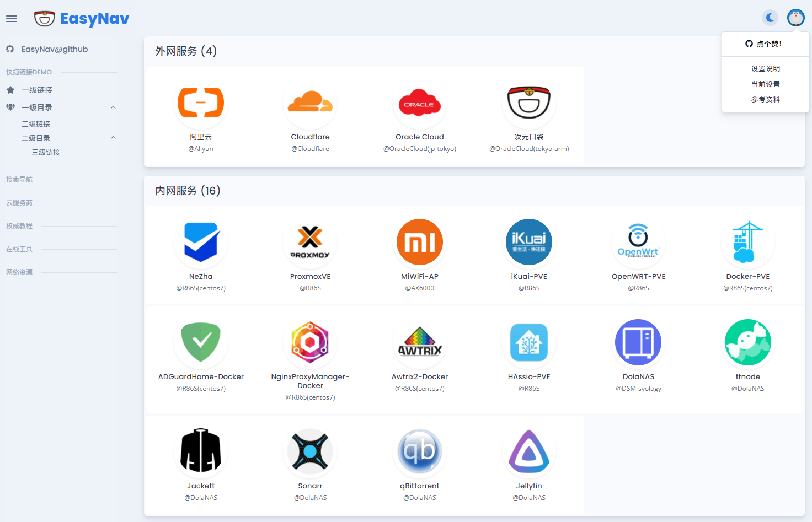

# EasyNav <!-- omit in toc -->

> 单页导航，仅需简单配置。

> **仅供小白参考，大神请绕道自撸代码**

<p align="center">

</p>

- 为满足内网简单导航的需求而设计
- 结构简单，MIT授权，提供基本思路，可随意修改
- 满足不同需求
  - 初级用户
    - 仅需修改 `config.json` 并添加图片资源即可使用
    - 仅需最基本的HTTP服务，或python的一行服务器 `python -m http.server 8000`
  - 进阶用户
    - 可修改整套前端框架，及对应的js动态模板
    
-----

__文档目录__

- [使用方法](#使用方法)
  - [修改配置](#修改配置)
  - [静态资源](#静态资源)
  - [部署页面](#部署页面)
- [进阶玩法](#进阶玩法)
  - [文件结构](#文件结构)
  - [修改指北](#修改指北)
- [版权声明](#版权声明)
- [备注(碎碎念)](#碎碎念)

-----

## 使用方法

 **git clone**
```bash
git clone https://github.com/dolaCmeo/EasyNav.git
```

 **下载并解压**
```bash
https://github.com/dolaCmeo/EasyNav/archive/refs/heads/main.zip
```

### 修改配置

 **修改 [`config.json`](https://github.com/dolaCmeo/EasyNav/blob/master/config.json)**
 - `Title`: 页面title
 - `brandTitle`: 内页标题
 - `brandLogo`: 内页标题LOGO
 - `avatar`: 用户头像(DEMO未使用)
 - `navLinks`: 快捷链接栏
   - `linkLabel`: 链接分类名
   - `items`: 展开项(最多三级，展开两次)
     - `icon`: 图标class(DEMO使用fontawesome)
     - `linkName`: 链接显示名
     - `linkUri`: 链接地址(为`null`时，启用`items`)
 - `navLists`: 导航展示区
   - `navName`: 导航分组名
   - `apps`: 导航链接
     - `name`: 展示名称(第一行)
     - `ps`: 备注内容(第二行)
     - `icon`: 静态图片`assets/icon`+<名>+`.png`
     - `addr`: 地址列表(目前只取第一个)


### 静态资源

**如需其他图标资源，请自行添加至**
[`/assets/icon`](https://github.com/dolaCmeo/EasyNav/tree/master/assets/icon)


### 部署页面

  **一切可以提供HTTP服务的都可以直接复制粘贴部署**

  如没有任何部署条件，建议安装`Python3`，
  执行[py3_server.bat]即可使用。

-----

## 进阶玩法

### 文件结构

```text
  ─┬─
   ├──── index.html                         页面
   ├──── config.json                        配置文件
   ├──── py3_server.bat                     win环境py3-http批处理
   ├────┐/assets                            静态资源
   │    ├───/js                             JavaScript
   │    │      /template-web.min.js         js原生模板工具
   │    │      /EasyNav.js                  js主代码
   │    ├───/css                            样式
   │    │      /styles.css                  主样式
   │    ├───/icon                           图标资源
   │    │      /*.png                       png图标图片
   │    └───/temp                           js模板目录
   │           /list.art                    导航模板
   │           /link.art                    链接模板
   │           /brand.art                   标题模板
   │           /mdfile.art                  Markdown模板
   ├─────/pages                             Markdown页面
   │        /remark.md                      备忘录页面
   │        /*.md                           其他md文件
   └────┐/vendors                           三方库目录
        ├───/jquery-*                       Jquery
        ├───/bootstrap-*                    Bootstrap
        ├───/fontawesome-*                  Fontawesome
        └───/markdown-it-*                  Markdown-it
```


### 修改指北


> 在此提供思路，仅供参考

1. 制作`厘`字型页面模板。既：左导航，顶栏，右下内容。
2. 分解各区域制作模板
  1. 导航区 `assets/temp/list.art`
  2. 链接区`assets/temp/link.art`
  3. 标题区 `assets/temp/brand.art`
  4. 文本区 `assets/temp/mdfile.art`
3. 修改`assets/js/EasyNav.js`:`makeEasyNav()`各区域绑定的`id`,`地址`
4. 使用`<a href="#!" onclick="showMdDoc()">显示Markdown</a>` 展示`markdwon`文档


-----

## 版权声明

- Bootstrap (MIT) 

  https://github.com/twbs/bootstrap

- jQuery (MIT)

  https://github.com/jquery/jquery

- Font Awesome ([GPL](https://fontawesome.com/license/free))

  https://github.com/FortAwesome/Font-Awesome

- art-template (MIT)

  https://github.com/aui/art-template

- markdown-it (MIT)

  https://github.com/markdown-it/markdown-it

- Start Bootstrap - SB Admin (MIT)

  https://startbootstrap.com/template/sb-admin

- Icons (Free)

  [所有图标图片均来自网络公开资源。](https://www.google.com/imghp)

- EasyNav (MIT)

  https://github.com/dolaCmeo/EasyNav

  **随便用，记得点赞 👍**
-----

## 碎碎念

  - 升级内网后想找个单页导航，都太复杂。遂放弃寻找，自撸代码。
  - 主思路就是简单解决问题，只需修改单配置文件即可自定义，不需要后端。
  - 完全开源，用的三方基本都是**MIT**，怎么玩都行。
  - 所有部分均可替代、补充，怎么改都行。
  - 后续还想增加一些功能，随缘更新。
  - **来都来了，顺手加个星 ⭐**
  - **`issues`开放，欢迎`fork`**


